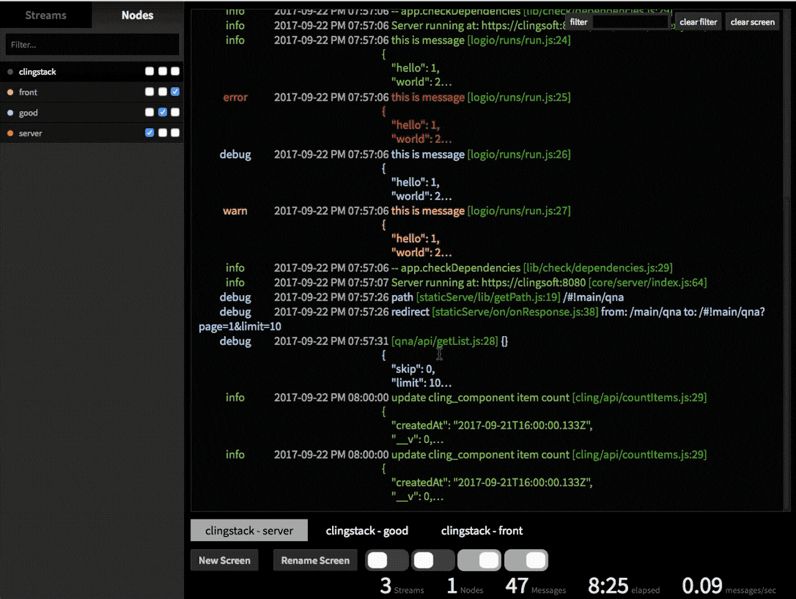

Log.io - Real-time log monitoring in your browser
=================================================

Powered by [node.js](http://nodejs.org) + [socket.io](http://socket.io)

## Fork from [Log.io](https://github.com/NarrativeScience/Log.io)




## What has changed?

The purpose is to display the server / front log on the screen alone.

## Install Server & Harvester
! Apply default https

1) Install via npm

    npm install -g https://github.com/prugel/logio.git --user "ubuntu"

2) Run server

    log.io-server

3) Configure harvester

    nano ~/.log.io/harvester.conf

4) Run harvester

    log.io-harvester

5) Browse to https://localhost:28778

## Install Server & Harvester with Docker


## Server TCP Interface

Send a log message, from web server to logio log_server
``` javascript
const options = {
  port: '0.0.0.0',
  host: 28777,
  rejectUnauthorized: false
};

(server.ssl ? tls : net).connect(options, function(socket) {
  const message = 'hello world';
  send('+log', 'server', 'AwesomeWeb', 'info', message);


  let message2 = 'another message';
  const data = [{
    hello: 'world',
    step: 1
  }, {
    name: 'james',
    step: 2
  }];
  data.forEach(function(meta) {
    message2 += '\n'+JSON.stringify(meta, null, 4);
  });
  send('+log', 'server', 'AwesomeWeb', 'debug', message2);


  function send() {
    socket.write([].slice.call(arguments).join('|') + '\r\n');
  }

});
```

``` javascript
const statusCode = Math.floor(data.statusCode/100)*100;
const responseTime = Math.min(Math.floor(data.responseTime/100)*100, 700);
const arr = [
  moment(data.timestamp).format('YYYY MM DD A hh:mm:ss'),
  `<span class="responseTime${responseTime}">(${data.responseTime}ms)</span>`,
  `${data.pid}:`,
  `<span class="status${statusCode}">${data.method}</span>`,
  data.path,
  data.query,
  `<span class="status${statusCode}">${data.statusCode}</span>`,
];
this.send('+log', this.logio.stream, this.logio.node, '', arr.join('&nbsp;&nbsp;&nbsp;'));
```

## Browser TCP Interface

Send a log message, from web page to logio log_server
- ws: work fine
- wss: wss can not be used with a self signed certificate
- wss: web page -> web server -> logio log_server
``` javascript
  var ws = new WebSocket("ws://0.0.0.0:28777");

  send('+log', 'front', 'AwesomeWeb', 'info', message);

  send('+log', 'front', 'AwesomeWeb', 'debug', message2);

  function send() {
    ws.send([].slice.call(arguments).join('|') + '\r\n');
  }
```

## Color table
! Allow html tags in messages.
! ansi to html apply
```
\x1b[30mblack\x1b[37mwhite

<span style="color:#000">black<span style="color:#AAA">white</span></span>
```
1. response time

  class | color
  ------------ | -------------
  responseTime0 | <span style="color: #48c9b0">#48c9b0</span>
  responseTime100 | <span style="color: #45b39d">#45b39d</span>
  responseTime200 | <span style="color: #5dade2">#5dade2</span>
  responseTime300 | <span style="color: #5499c7">#5499c7</span>
  responseTime400 | <span style="color: #eb984e">#eb984e</span>
  responseTime500 | <span style="color: #dc7633">#dc7633</span>
  responseTime600 | <span style="color: #cd6155">#cd6155</span>
  responseTime700 ~ | <span style="color: #e74c3c">#e74c3c</span>
2. status code

  class | color
  ------- | ------
  status200 | <span style="color: #2ca02c">#2ca02c</span>
  status300 | <span style="color: #1f77b4">#1f77b4</span>
  status400 | <span style="color: #ff7f0e">#ff7f0e</span>
  status500 | <span style="color: #d62728">#d62728</span>
3. log level message

  class | color
  ------- | ------
  debug | <span style="color: #aec7e8">#aec7e8</span>
  info | <span style="color: #86af49">#86af49</span>
  warn | <span style="color: #f2ae72">#f2ae72</span>
  error | <span style="color: #c94c4c">#c94c4c</span>

4. line

  class | color
  ------- | ------
  line | <span style="color: #2ca02c">#2ca02c</span>

5. time

  class | color
  ------- | ------
  time | <span style="color: #aaa">#aaa</span>

## Virtual scroll
... not

## Credits

- Mike Smathers &lt;msmathers@narrativescience.com&gt; ([msmathers](http://github.com/msmathers))

- Narrative Science http://narrativescience.com ([NarrativeScience](http://github.com/NarrativeScience))

## Acknowledgements

- Jeremy Ashkenas ([jashkenas](https://github.com/jashkenas))

- Guillermo Rauch &lt;guillermo@learnboost.com&gt; ([Guille](http://github.com/guille))

- Ryan Dahl &lt;ry at tiny clouds dot org&gt; ([ry](https://github.com/ry)) + Joyent http://www.joyent.com/ ([joyent](https://github.com/joyent/))

- [turtlebender](http://github.com/turtlebender)

- [jdrake](http://github.com/jdrake)

## License

Copyright 2013 Narrative Science &lt;contrib@narrativescience.com&gt;

Licensed under the Apache License, Version 2.0 (the "License");
you may not use this file except in compliance with the License.
You may obtain a copy of the License at

    http://www.apache.org/licenses/LICENSE-2.0

Unless required by applicable law or agreed to in writing, software
distributed under the License is distributed on an "AS IS" BASIS,
WITHOUT WARRANTIES OR CONDITIONS OF ANY KIND, either express or implied.
See the License for the specific language governing permissions and
limitations under the License.
